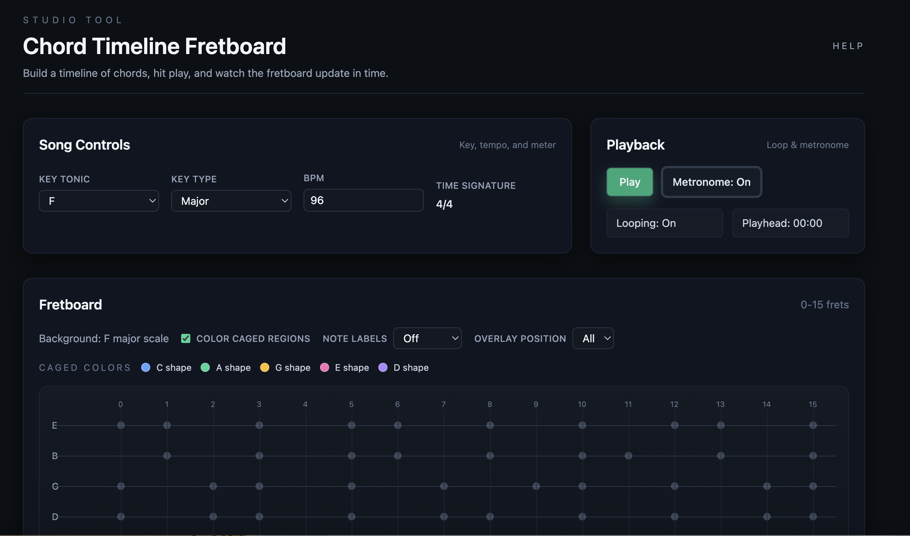

# Chord Timeline Fretboard

A studio-style guitar practice tool for building chord timelines and visualizing scale and chord tones across the fretboard.

## Screenshot



## Features

- Chord timeline playback with metronome and looping.
- Always-on song key scale as a muted background layer.
- Overlay modes: chord tones, arpeggio (note-set), pentatonic, and voicing.
- Root-note highlighting for the active chord overlay.
- CAGED color mapping for position awareness.
- Overlay position filtering by C/A/G/E/D regions.

## Why this is useful

Practicing with a timeline forces you to hear chord changes in time while keeping your hands in a specific region of the neck. The overlay modes make it easy to move from scale practice into chord-tone targeting.

## What is CAGED?

CAGED is a framework of five chord shapes (C, A, G, E, D) that map the guitar neck. This app uses CAGED in two ways:

- Color-coded dots show which shape region a note belongs to.
- The Overlay Position filter limits practice to a single CAGED box.

## Getting Started

```bash
npm install
npm run dev
```

Then open `http://localhost:3000`.

## Usage examples

Pop progression (Key: G major):
- I – V – vi – IV (1 bar each)

12-bar blues (Key: A):
- A7 / D7 / E7

Minor groove (Key: A minor):
- i – bVII – bVI – bVII

Jazz-ish turnaround (Key: C):
- Cmaj7 – Am7 – Dm7 – G7 (2 bars each)

## Help

There is a built-in help page at `/help` and an in-app timeline help modal with examples you can load directly.

## Roadmap / TODO

- Auto-follow CAGED position per chord.
- Chord-relative number labels option.
- Interval labels toggle.
- Finger numbers / chord-box diagram option.
- Beat-level and sub-beat arpeggio stepping (true arpeggio playback).
- Chord voicing generator (algorithmic).
- More advanced scales/modes, melodic/harmonic minor.
- Drag-and-drop timeline.
- Save/load songs, shareable URLs.
- Roman numeral parsing improvements.

## License

No license file is included. Consider adding MIT if you plan to open-source this project.
